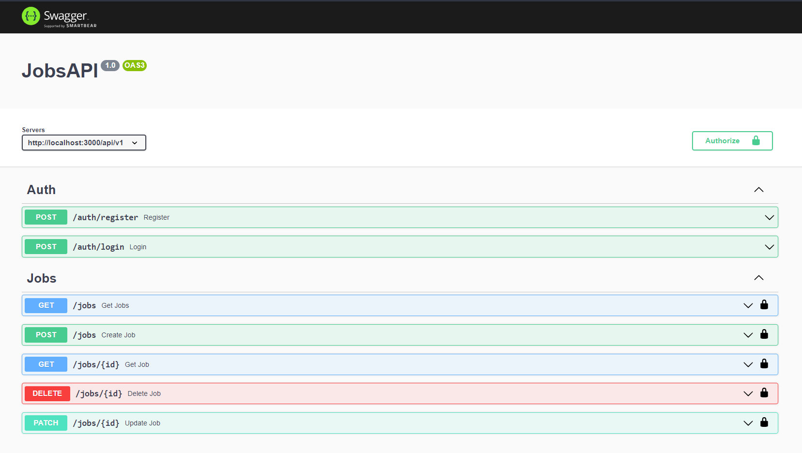

# Jobs API

This is a basic REST API with simple auth routes, as well as a CRUD for managing and organizing job applications. It was built with Nodejs, Express, MongoDB and JWT just for learning purposes.

The API was made following along the [John Smilga](https://github.com/john-smilga)'s [NodeJS Course](https://www.udemy.com/course/nodejs-tutorial-and-projects-course/).

# Endpoints

